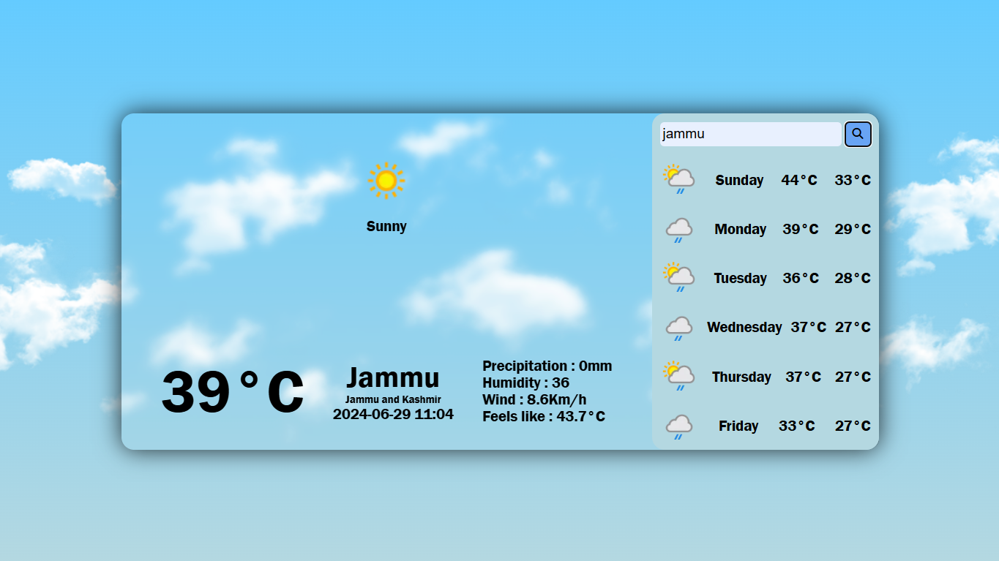
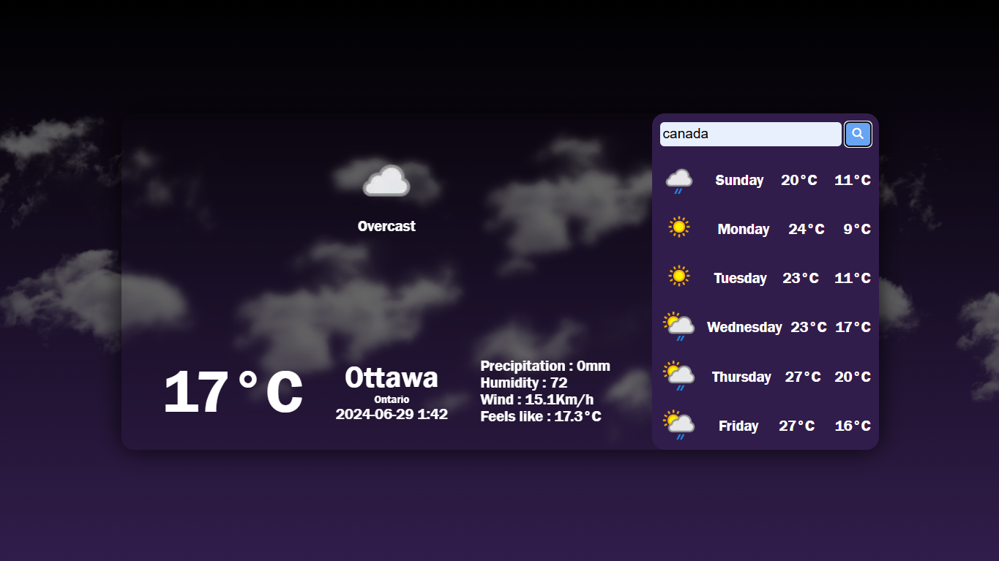
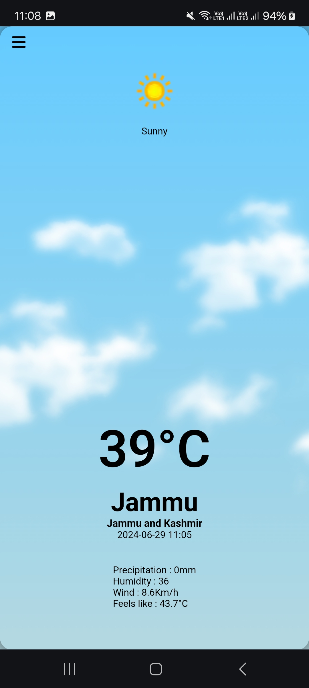
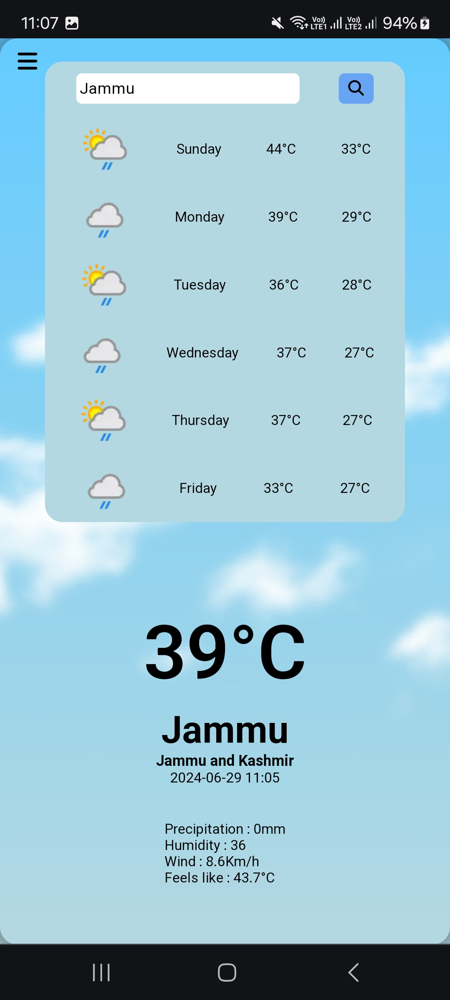
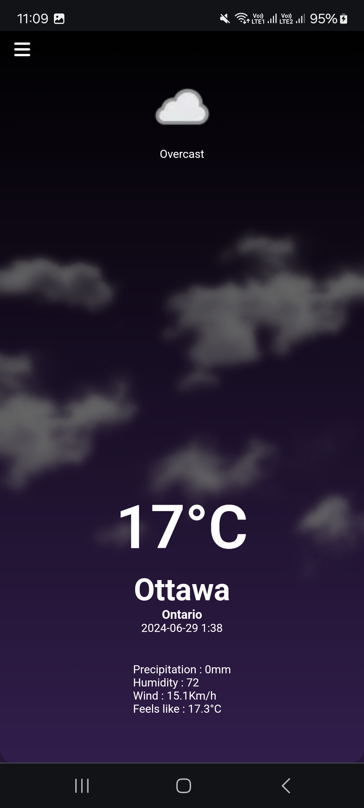
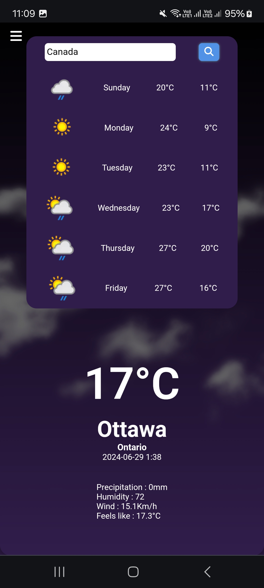

 

  <h1 align="center"> **Weather Website** </h1>
  

    A simple and responsive weather website along with weather forecast. 
     
     
  

## Table Of Contents

-   [About the Project](#about-the-project)
-   [Built With](#built-with)
-   [Getting Started](#getting-started)
-   [Authors](#authors)

 

## About The Project
 

  

Weather website is a simple and efficient website made with the help of [WeatherAPI](https://www.weatherapi.com) . 
As a responsive website it is functional on various sorts of media devices. 
 

Key Features:

-   Changes theme according to day and night.
-   Can search various locations using a range of queries.

            • City Name
            • Latitudes and Longitudes
            • Postal Code
            • Zip Code
            • Postal Code
            • 3 Digit Airport Code
            • IP Address
-   Real time weather information.
-   Weather forecast for upcoming week.
-   Works on multiple devices.
-   Fast and accurate information.

 

## Built With

-   HTML
-   CSS
-   JavaScript

and thats it!
 

## Getting Started
 

Go to [WeatherAPI](https://www.weatherapi.com) to get started.

Signup to create an account and get your unique API key.

Replace the following with your API key in script.js.

      • const APIkey = "Your_API_key"

 

## Authors

-   **Vasundhra Sharma** - [sharmavasundhra18](https://github.com/sharmavasundhra18)

 
<h3 align="center">
Thank you ❤️
</h3>

